# Plugin contract for phase one

Example json schema for plugin for phase one.

```js
{
    version: Version.CurrentVersion,
    controlName: 'X-Widget',
    description: 'Simple custom control',
    searchTerms: ['plugin'],
    groupName: 'Custom controls',
    iconUrl: 'one-line-text',
    properties: {
        intAttr: {
            title: 'Integer attribute',
            description: 'From 1 - 10',
            type: 'integer',
            minimum: 1,
            maximum: 10,
            defaultValue: 1,
        },
        numberAttr: {
            title: 'Decimal attribute',
            description: 'From 1 - 10',
            type: 'number',
            minimum: 1,
            maximum: 10,
            defaultValue: 1.23,
        },
        textAttr: {
            title: 'Text attribute',
            type: 'string',
            maxLength: 255,
            defaultValue: 'abc',
        },
        boolAttr: {
            title: 'Boolean attribute',
            type: 'boolean',
            defaultValue: true,
        },
        choiceAttr: {
            title: 'Choice attribute',
            type: 'string',
            enum: ['Option A', 'Option B', 'Option C'],
            showAsRadio: true,
            verticalLayout: true,
            defaultValue: 'Option A',
        },
        value: {
            title: 'Value',
            type: 'string',
            isValueField: true,
            defaultValue: 'hello world'
        },
        configureFieldLabel: false,
        configureDefaultValue: false,
        configureDescription: false,
        configureVisiblity: false,
        configureReadOnly: false,
        configureRequired: false,
        configureToolTip: false,
    },
    designer: {
        staticProperties: ['boolAttr', 'numberAttr', 'choiceAttr'],
        canvasRestrictions: {
            minSize: 6,
            isFullRow: false,
        }
    }
}
```

## 1. Basic properties

### 1.1. `version` property

This would be a constant from the npm package and would align with the form version.

### 1.2. `title` property

The `title` porperty is the display name of the control in the toolbar.

```js
// plugin schema
{
    title: "X-Widget"
    ...
}
```

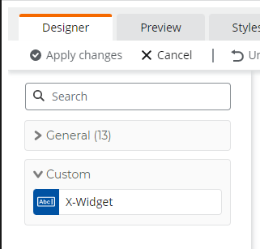

### 1.3. `description` property

The `description` defines the tooltip when hovering over the plugin in toolbar.

```js
// plugin schema
{
    description: "Simple custom control"
    ...
}
```

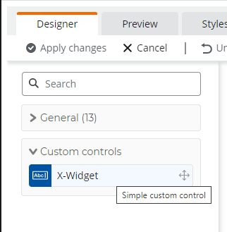

### 1.4. `groupName` property

The `groupName` is the name of the category that contains the plugin.

```js
// plugin schema
{
    groupName: "Custom controls"
    ...
}
```

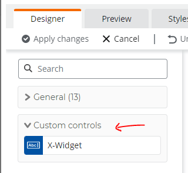

### 1.4. `searchTerms` property

The `searchTerms` is a list of key words that can be used to search for the control in toolbar.

```js
// plugin schema
{
    searchTerms: ['plugin'],
    ...
}
```

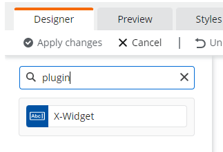

### 1.5. `iconUrl` property

The `iconUrl` defines icon used for the control in toolbar. Ideally we want to support url for the property, but it will require some dev work. For now we will only support predefined icons.

Possible values:

- `one-line-text`
- `one-line-numbers`
- `date-picker`

```js
// plugin schema
{
    iconUrl: "one-line-text",
    ...
}
```

## 2. `properties`

`properties` defines the attributes that the plugin expected as input. It also defines the configuration panel for the plugin. All attributes will also show up in rule builder, unless the property is marked as static (see `staticProperties`).

```js
// plugin schema
{
    properties: {
        number: {
            title: 'Decimal attribute',
            type: 'number'
        },
        text: {
            title: 'Text attribute',
            type: 'string'
        }
    }
    ...
}
```

```html
<!-- Renderring of the plugin in html -->
<x-widget number="123" text="abc"></x-widget>
```

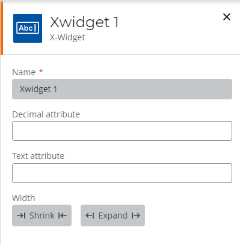
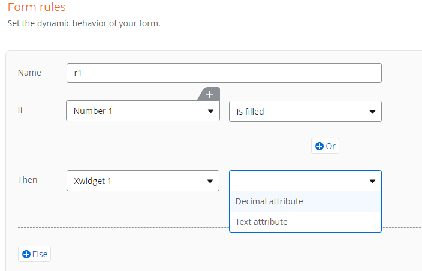

### 2.1. Common properties

There are set of common properties that are avaliable to all controls in config panel.

- `title` - The title of the control in config panel.
- `description` - The description of the control in config panel.
- `defaultValue` - The inital value of the property.
- `type` - The type of the property (similar to `type` in `json schema`).
- `format` - The format of the property (similar to `format` in `json schema`).
- `isValueField` - When is `true`, it means the property is also used as output property. When opening a form in draft, the existing value of the plugin control will be passed to the property that marked as value field. The type of the property is also the type of the return value of the plugin control. Default value of the property will be used as default value of the plugin.

```js
// plugin schema
{
    title: "X-Widget",
    ...
    properties: {
        intAttr: {
            title: "Integer attribute",
            description: "This input attribute has an integer value",
            defaultValue: 10,
            type: "number",
            format: "integer"
        },
        value: {
            title: 'Value',
            type: 'string',
            isValueField: true,
            defaultValue: 'hello world'
        },
    }
}
```

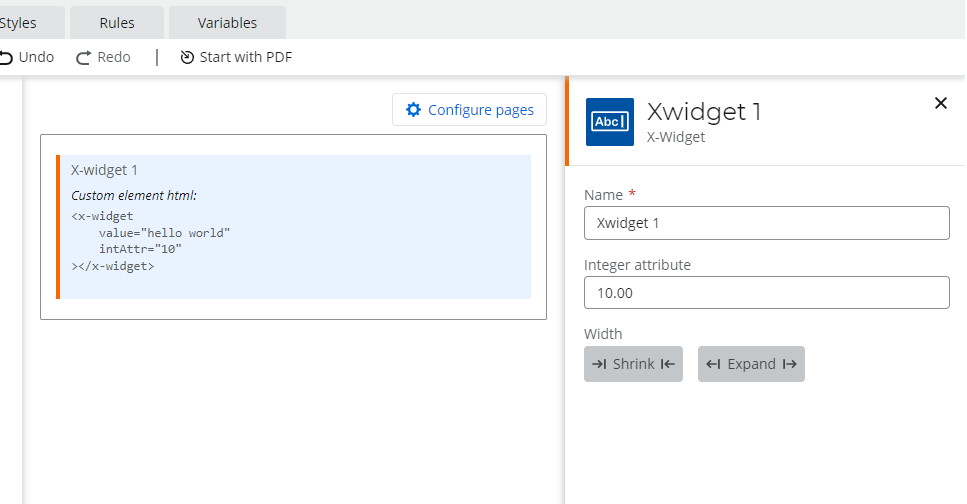

### 2.1. Specific properties to Number type

There are set of properties that are specific to Choice type property.

- `maximum` - Maximum value of the property.
- `minimum` - Minimum value of the property.

```js
{
    properties: {
        intAttr: {
            title: 'Integer attribute',
            description: 'From 1 - 10',
            type: 'integer',
            minimum: 1,
            maximum: 10,
            defaultValue: 1,
        },
    }
}
```

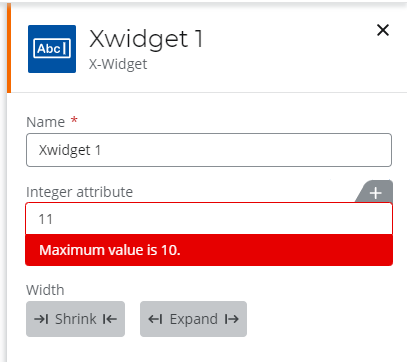

### 2.2. Specific properties to Number type

There are set of properties that are specific to Choice type property.

- `maxLength` - Maximum length of text.

```js
{
    properties: {
        textAttr: {
            title: 'Text attribute',
            type: 'string',
            maxLength: 255,
            defaultValue: 'abc',
        },
    }
}
```

### 2.3. Specific properties to Choice type

There are set of properties that are specific to Choice type property.

- `showAsRadio` - If TRUE then show options as radio buttons, otherwise show as dropdown.
- `verticalLayout` - If TRUE then show options vertically.

```js
{
    properties: {
        choiceAttr: {
            title: 'Choice attribute',
            type: 'string',
            enum: ['Option A', 'Option B', 'Option C'],
            showAsRadio: true,
            verticalLayout: true,
            defaultValue: 'Option A',
        },
    }
}
```

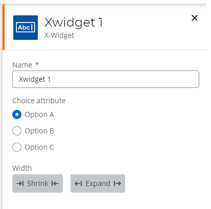

## 3. `designer` property

The `designer` section in the schema defines a set of advance properties of the form at design time.

### 3.1. `staticProperties` property

`staticProperties` contains controls that should not be updated dynamically. When a property is marked as static, user will not be able to add variable to the property in config panel, and the property will not show in rule builder in THEN clause.

```js
{
    title: 'X-Widget',
    ...
    properties: {
        intAttr: {
            title: 'Integer attribute',
            type: 'number',
            format: "integer"
        },
        textAttr: {
            title: 'Text attribute',
            type: 'string'
        },
    },
    designer: {
        staticProperties: ['textAttr']
    }
}
```

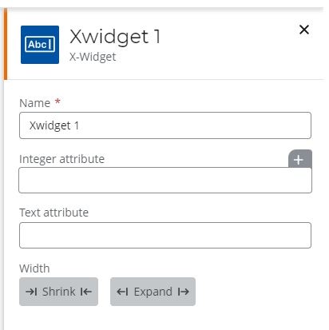
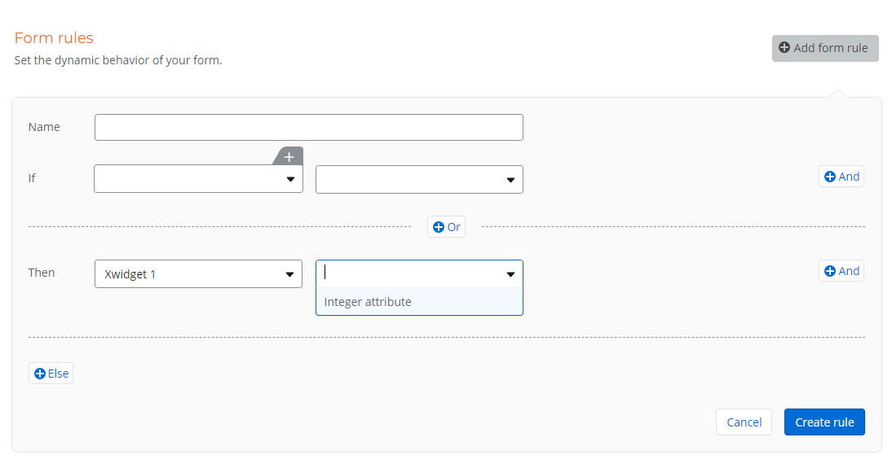

### 3.2. `canvasRestrictions` property

The `canvasRestrictions` controls the behavior when dragging the plugin to canvas.

- `minSize` controls the minmus size of a control in a row. The possible value is `1 to 12`.
- `isFullRow` idicates that if the control should take the whole row.

```js
// plugin schema
{
    designer: {
        canvasRestrictions: {
            // Given there is maximun 12 columns, 6 means the control will take half of the row.
            minSize: 6,
            isFullRow: false,
        }
    }
}
```


## 4. `events`

`events` contains a list of events that the plugin will dispatch. The event will also be avaliable in rule builder in IF clause.

```js
// plugin schema
{
    ...
    events: ["click"]
}
```

```html
<!-- Renderring of the plugin in html -->
<x-widget (click)="onEvent($event)"></x-widget>
```

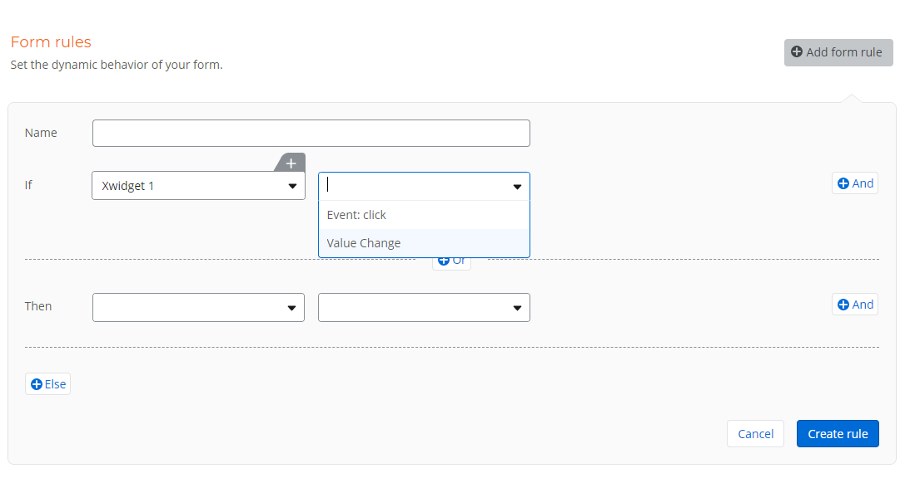
